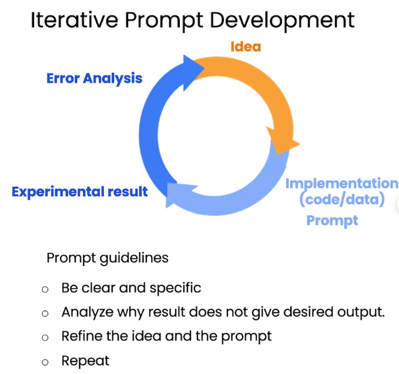

# Section 3: Iterative

## Overview

The "Iterative" section delves into the importance of an iterative approach in prompt engineering when working with Large Language Models (LLMs). Iteration is a process of refining and improving prompts to achieve more accurate and relevant responses, emphasizing the necessity of experimenting, evaluating, and adjusting prompts continuously.

## Key Points - Iterative Prompt Development

- Prompt guideline:
  - Be clear and specific
  - Analyze why resultt does not give desired output
  - Refine the idea and the prompt
  - Repeat
- Iterative Process:
  - Try something
  - Analyze where the result does not give what you want
  - Clarify instructions, give more time to think

- **Understanding the Iterative Process:**
  - Iteration is central to successful prompt engineering. The first attempt at crafting a prompt might not yield the perfect result, so it's crucial to iterate—refining and adjusting the prompt based on the responses received.
  - **Experimentation:** Trying different approaches or variations in your prompts helps discover what works best. Experimenting with phrasing, structure, and the level of detail can lead to significant improvements in the output.
  
- **Evaluating Responses:**
  - After receiving an initial response from the LLM, evaluate the output critically. Assess whether it meets the expectations set by your prompt and identify any gaps or areas of improvement.
  - **Feedback Loop:** Create a feedback loop where the results guide your next steps in prompt refinement. This continuous loop of evaluation and adjustment is key to enhancing the effectiveness of your prompts.

- **Refining Prompts:**
  - **Incremental Changes:** Rather than overhauling a prompt completely, make incremental changes. Small adjustments can sometimes have a substantial impact on the quality of the response.
  - **Learning from Mistakes:** Not all prompts will work perfectly the first time. Learning from less successful attempts and understanding why certain prompts didn’t perform well is part of the iterative process.
  
- **Examples of Iterative Prompting:**
  - Practical examples illustrate how iterative prompting works in real scenarios. The section might include case studies or hypothetical situations where a prompt is refined over several iterations to achieve the desired result.
  - **Use of Specific Techniques:** Techniques such as rephrasing, adding context, or breaking down complex requests into simpler sub-tasks can be explored to improve LLM responses.

- **The Value of Iteration:**
  - Iteration allows developers to fine-tune their interactions with LLMs, leading to more precise and reliable outputs. It's a process of discovery, learning, and improvement, essential for maximizing the utility of LLMs.
  - **Iterative Mindset:** Adopting an iterative mindset encourages continuous improvement and flexibility, which are crucial when dealing with the dynamic nature of LLM outputs.

## Example

Refer [03-Iterative Notebook: Take the fact sheet and help a marketing team write a description for an online retail website](../notebook/l3-iterative-prompt-development.ipynb)

### Summary

The "Iterative" section emphasizes the importance of refining and adjusting prompts through an iterative process. By experimenting with different approaches, evaluating responses critically, and making incremental changes, developers can significantly enhance the accuracy and relevance of the outputs from LLMs. This iterative approach is fundamental for effective prompt engineering, ensuring that interactions with LLMs are continuously optimized for better performance.
