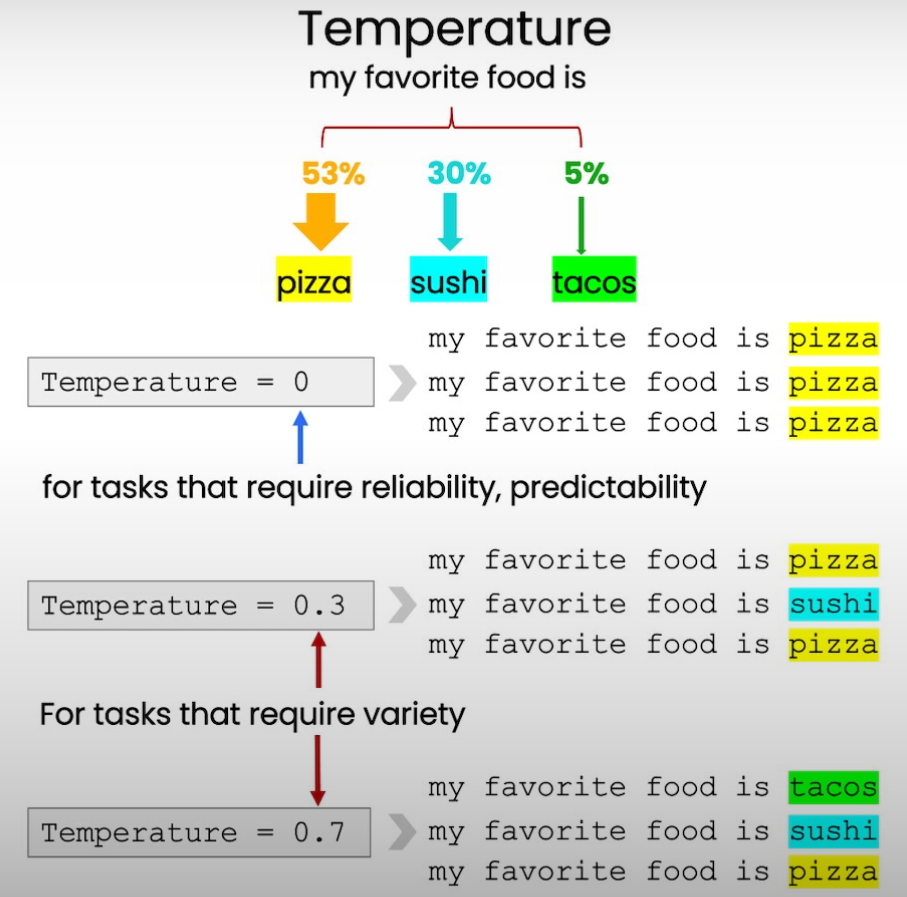

# Section 7: Expanding

## Overview

The "Expanding" section discusses how to leverage Large Language Models (LLMs) to expand upon given content. This involves generating additional text that builds on the initial input, often enriching the content with more detail, explanations, or creative elaborations.

## Key Points

- **Understanding Text Expansion:**
  - Text expansion refers to the process of adding more content to a given piece of text. This can involve elaborating on ideas, adding examples, or creating detailed narratives based on a short prompt.
  - **Use Cases:** Common applications include generating detailed explanations, expanding bullet points into full paragraphs, creating stories or scenarios from brief descriptions, and adding context or background information to a topic.

- **Techniques for Effective Expansion:**
  - **Clear and Detailed Prompts:** Start with a clear and detailed prompt that outlines the desired expansion. This helps the LLM understand the direction in which to expand the content.
  - **Building on Key Ideas:** Encourage the LLM to focus on key ideas from the original text and expand on them with additional details, examples, or related concepts.
  - **Layered Expansion:** Use iterative prompts to gradually expand the content. Begin with a basic expansion and then refine it by asking the LLM to add more layers of detail or explore specific aspects further.

- **Challenges in Text Expansion:**
  - **Maintaining Relevance:** One of the main challenges is ensuring that the expanded content remains relevant to the original topic. It's important to guide the LLM to stay focused and avoid drifting into unrelated areas.
  - **Avoiding Redundancy:** Expansions should add value to the original content, rather than repeating information. This requires careful prompting and review of the output to ensure new and meaningful content is being generated.

- **Improving Expansion Quality:**
  - **Contextual Cues:** Providing additional context or background information can help the LLM generate more relevant and coherent expansions. This can include details about the intended audience, purpose, or specific aspects of the topic to focus on.
  - **Specific Instructions:** Offering specific instructions on how to expand the text can lead to better results. For example, asking the LLM to "provide an example," "add a historical background," or "elaborate on the implications" can guide the expansion process.
  - **Iterative Refinement:** As with other tasks, refining the expansion through multiple iterations can lead to more polished and targeted content. Reviewing initial outputs and adjusting the prompt can help fine-tune the expansion.

- **Evaluating Expansion Outputs:**
  - **Relevance and Coherence:** The expanded text should be closely related to the original content and should flow logically from it. The expansion should enhance the original message rather than detract from it.
  - **Depth and Insight:** Effective expansions should add depth and insight to the original content, providing new perspectives or additional layers of understanding.
  - **Clarity and Readability:** The expanded text should be clear and easy to read, with any new content seamlessly integrated into the existing text.

## Example

Refer [07 - Expanding Notebook:](../notebook/l7-expanding.ipynb)

- Customize the automated reply to a customer email
- Remind the model to use details from the customer's email

## Summary

The "Expanding" section provides a comprehensive guide to using LLMs for text expansion tasks. By crafting detailed prompts, focusing on key ideas, and providing specific instructions, developers can effectively expand content with LLMs. The section highlights the importance of maintaining relevance, avoiding redundancy, and refining outputs iteratively to achieve coherent and valuable expansions.
