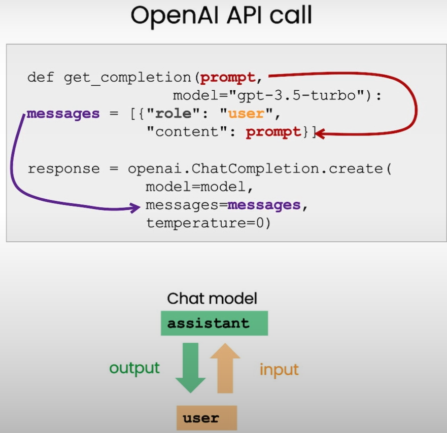
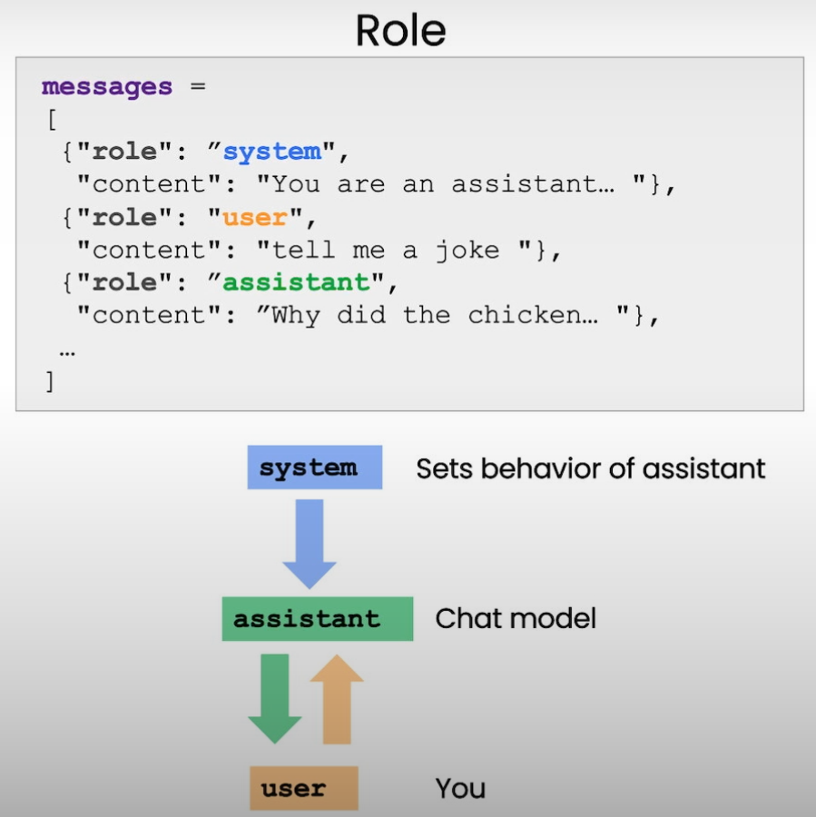

# Section 8: Chatbot

## Overview

In this section, the focus is on building chatbots using Large Language Models (LLMs). It covers best practices, techniques, and considerations for creating effective and engaging chatbot experiences.

## Key Points

Single prompt - Single completion : Single-turn task without any conversation:

Mul

- **Understanding Chatbots with LLMs:**
  - Chatbots powered by LLMs are designed to engage in natural language conversations with users. They can handle a wide range of tasks, from answering questions to providing personalized recommendations.
  - **Use Cases:** These include customer support, virtual assistants, educational tools, and more. LLM-based chatbots can adapt to various industries and user needs.

- **Designing Effective Prompts:**
  - **Clear and Purposeful Prompts:** The design of prompts is crucial in determining the chatbot's effectiveness. Prompts should be clear and aligned with the chatbot's purpose, guiding the LLM to provide relevant responses.
  - **Maintaining Context:** It's important to structure prompts in a way that maintains the context of the conversation. This allows the chatbot to deliver coherent and contextually appropriate responses.

- **Handling User Inputs:**
  - **Interpreting Ambiguous Inputs:** LLMs need to be capable of interpreting ambiguous or unclear user inputs. Strategies such as asking clarifying questions or providing multiple response options can help manage this challenge.
  - **Responding with Flexibility:** The chatbot should be flexible in handling various types of user inputs, whether they are direct questions, commands, or casual conversation. This enhances the user experience by making the chatbot more responsive and adaptable.

- **Managing Conversations:**
  - **Flow Control:** Effective chatbots manage the flow of conversation by guiding users through predefined paths or allowing for more open-ended interactions depending on the context.
  - **Engagement Techniques:** Using engagement techniques, such as asking follow-up questions or offering personalized responses, can help keep the user engaged and make the conversation more interactive.

- **Best Practices for Chatbot Development:**
  - **Consistency in Responses:** Ensuring that the chatbot provides consistent and reliable responses is key to building user trust. This involves testing the chatbot extensively across various scenarios.
  - **Personalization:** Incorporating personalization in chatbot interactions can significantly improve user satisfaction. This includes remembering user preferences and tailoring responses based on past interactions.
  - **Handling Errors:** Developing a strategy for handling errors or unexpected user inputs is crucial. This can include providing helpful error messages or redirecting the conversation to a more manageable topic.

- **Ethical Considerations:**
  - **Bias Mitigation:** Care must be taken to mitigate any biases in the chatbot's responses. This requires ongoing evaluation and refinement of the LLM to ensure it delivers fair and unbiased interactions.
  - **User Privacy:** Protecting user privacy is essential, especially when dealing with sensitive information. Developers should implement measures to safeguard user data and maintain confidentiality.

- **Evaluating and Iterating:**
  - **Continuous Improvement:** The development of a chatbot is an iterative process. Regularly evaluating the chatbot's performance and making improvements based on user feedback is necessary to ensure its effectiveness.
  - **User Testing:** Engaging users in the testing process can provide valuable insights into how the chatbot performs in real-world scenarios. This feedback loop helps in refining the chatbot to better meet user needs.

## Example

Refer [08- Chatbot Notebook:](../notebook/l8-chatbot.ipynb)

## Summary

The "Chatbot" section provides a comprehensive overview of how to develop LLM-based chatbots. By focusing on clear prompts, context management, and user engagement, developers can create chatbots that are not only effective but also engaging and user-friendly. The section emphasizes the importance of consistency, personalization, and ethical considerations in chatbot development, while also highlighting the need for continuous evaluation and iteration to maintain and improve the chatbot's performance.
